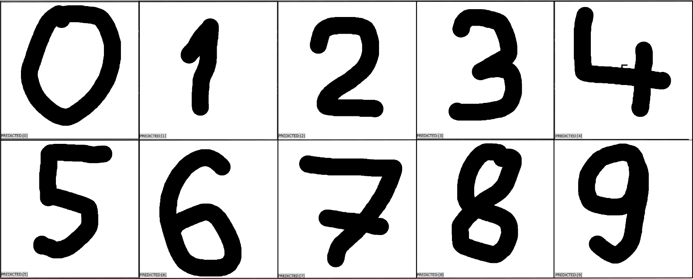

# Handwritten digits recognition system
* C-Support Vector Classification (SVC) model to predict hand-drawn digits.
* GUI application to predict the digits entered by the user.
## Requirements
__*All of the following pip requirements are included in 'requirements.txt' with their respective versions*__
* Python 3.5 +
* Scikit-Learn
* Matplotlib
* Tkinter
* pickle5
* Pillow
* Numpy

# Setup
```bash
python3 -m venv .venv
source .venv/bin/activate
pip install -r requirements.txt
python3 gui_app.py
```
# Train model
*Within the framework of this project, the Support Vector Classification (SVC) model was chosen because it allows the model to be tailored to the specific characteristics of the numbers for effective classification.*

**To train the model, run Jupyter server and open the ./traning/traning_pipeline.ipynb file**

## Tranining pipeline include:
- Importing appropriate libraries and modules.
- Load and preparing Data (This project uses ["sklearn dataset - digits"](https://scikit-learn.org/stable/modules/generated/sklearn.datasets.load_digits.html). The dataset consists of images of digits, each image being **8x8 pixels in size, resulting in 64 features**), *e.g. reshaping, spliting to traning and test sets*.
- Training the **'C-Support Vector Classification'** model, using the **'GridSearchCV'** module, to better fit the estimator values.
- Serialization of the model using the pickle library.

**This route yields an SVC model that makes predictions, with an accuracy of 0.99 (test performed on a separate test set)**

# GUI usage
1. Draw a digit by holding down the left mouse button.
2. Make a prediction by pressing the middle button (wheel) of the mouse.
3. Using the left mouse button, you can clear the sketchbook.

# Algorithm for prediction of digits drawn in GUI application
1. Taking an image from Canvas and converting it to postscript.
2. Przetworzenie postscript na obraz za pomocą biblioteki Image.
3. Resize the image to 8x8 pixels, convert to grayscale and reverse the colors.
4. Przekształcenie macierzy pixeli obrazu z postaci 2D na postać 1D o wymiarach [1, 64].
5. Convert the pixel matrix from 8-bit to 4-bit.
6. Making a prediction using a pre-trained model.

# Summary of model accuracy

**The test data set was randomly selected and represents 30% of all records (1797 items).**

*Classification report*

| Digit        | precision | recall | f1-score | support |
|:------------:|:---------:|:------:|:--------:|:-------:|
| 0            | 1.00      | 1.00   | 1.00     | 56      |
| 1            | 1.00      | 1.00   | 1.00     | 66      |
| 2            | 1.00      | 1.00   | 1.00     | 57      |
| 3            | 1.00      | 0.98   | 0.99     | 47      |
| 4            | 1.00      | 1.00   | 1.00     | 59      |
| 5            | 1.00      | 0.96   | 0.98     | 52      |
| 6            | 1.00      | 1.00   | 1.00     | 58      |
| 7            | 0.98      | 1.00   | 0.99     | 46      |
| 8            | 1.00      | 1.00   | 1.00     | 43      |
| 9            | 0.97      | 1.00   | 0.98     | 56      |
| accuracy     | -         | -      | **0.99**     | 540     |
| macro avg    | 0.99      | 0.99   | 0.99     | 540     |
| weighted avg | 0.99      | 0.99   | 0.99     | 540     |


# Prediction examples
## *Some examples of prediction made in GUI application*

