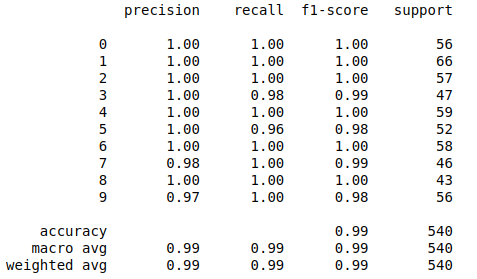

# Handwritten digits recognition system
* C-Support Vector Classification (SVC) model to predict hand-drawn digits.
* GUI application to predict the digits entered by the user.
## Requirements
* Python 3.5 +
* Scikit-Learn (latest version)
* Matplotlib
* Tkinter
* io module
* pickle5
* Pillow
* Numpy

# Setup and run
1. Install requirements
```bash
pip install -r requirements.txt
```
2. Run application
```bash
python3 gui_app.py
```
# Usage
1. Draw a digit by holding down the left mouse button.
2. Make a prediction by pressing the middle button (wheel) of the mouse.
3. Using the left mouse button, you can clear the sketchbook.

# Summary of model accuracy
<p align="center">
  
</p>

# Prediction examples
